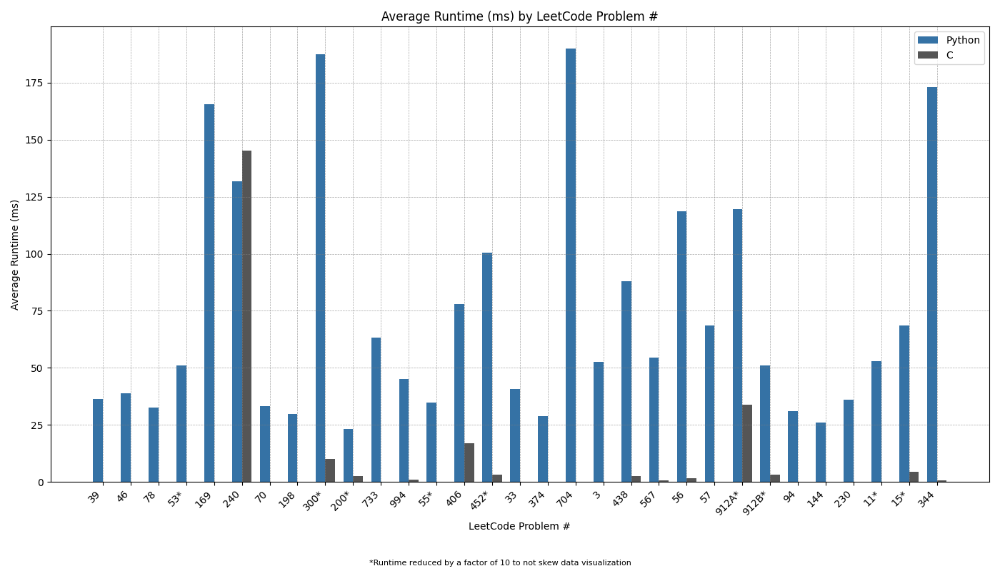
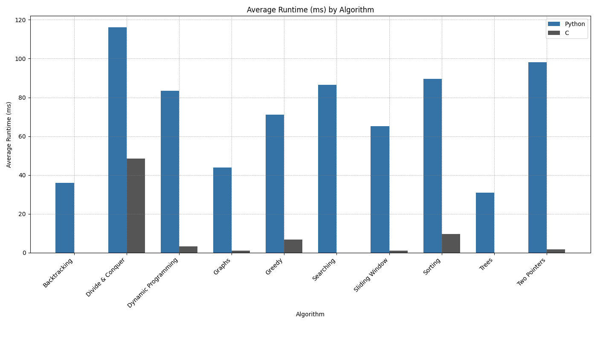
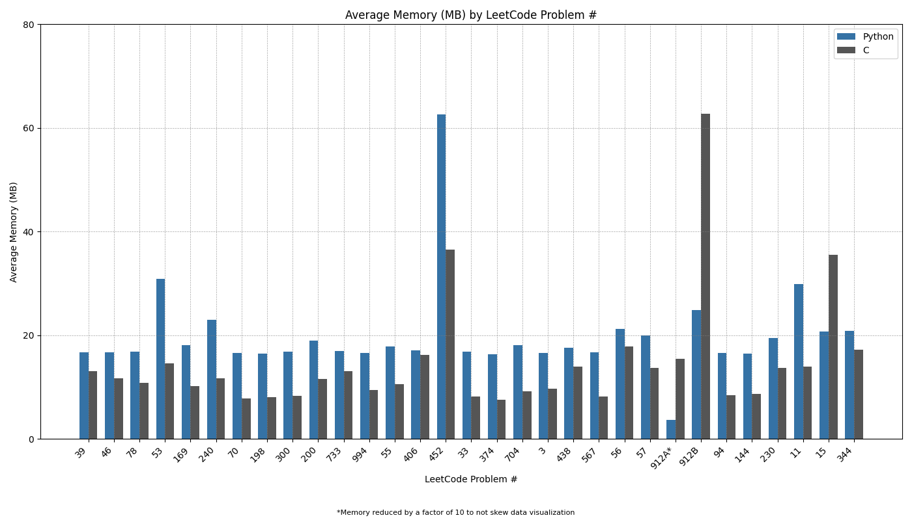
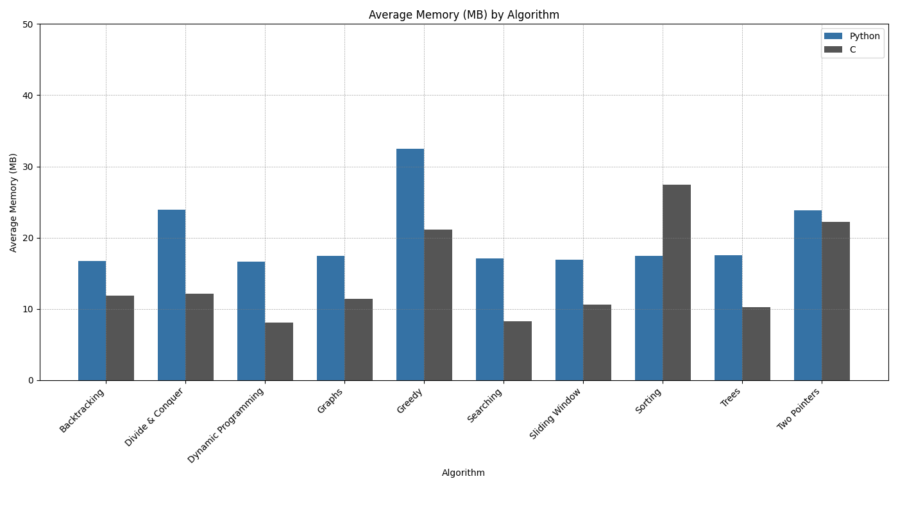

# Analyzing Python and C Performance in LeetCode Problems

## Premise

This repository serves as the third and final entry in my 3 part series comparing Python's LeetCode performance to that of C++, C#, and C. Since this is a didactic project with a focus on C syntax, the solutions in C contain additional lines of code not found in the Python solutions. These additional lines of code were not part of the submitted solutions.

If you would like to skip to the comparative charts, [click here](#charts).

## Method

To make the comparison concrete, I first selected 10 different algorithmic problem sets featured on LeetCode. From these sets, I chose 3 representative problems.

For each problem, I developed a solution in Python and then translated that solution into C# (with one exception that I'll touch on later). I aimed to keep the logic and structure as similar as possible between the two languages to allow for a fair comparison.

The exception case I mentioned earlier was LeetCode problem 912, which was part of the selections focusing on sorting algorithms. Given that there is a built-in method that can reduce an otherwise lengthy solution down to a couple lines of code in both languages, I felt both approaches merited inclusion.

Once I was satisfied with the solutions, I submitted each solution three times in the LeetCode sandbox to procure a broader dataset. I recorded the runtime (in milliseconds) and memory usage (in megabytes) for each submission, then averaged those values to obtain a single runtime and memory figure for each problem. After that, I averaged the mean values for each problem to get an average runtime and memory figure for each algorithm. The runtime and memory figures for each problem and algorithm served as the cornerstones of this performance comparison.

Before getting to the results, I want to acknowledge that LeetCode is not the ideal way to test the efficacy of each language’s solutions. Both runtime and memory readings can be skewed by the quality of the user’s machine or by the number of users on the LeetCode platform at the time of testing. However, given the prevalence of LeetCode style coding challenges in competitive programming, it was a logical choice to streamline performance testing.

## Results

Runtime Comparison

 

* Backtracking - C was 36x faster
* Divide & Conquer - C was 2.398x faster
* Dynamic Programming - C was 24.871x faster
* Graphs - C was 37.899x faster
* Greedy - C was 10.48x faster
* Searching - C was 86x faster
* Sliding Window - C was 58.606x faster
* Sorting - C was 9.237x faster
* Trees - C was 31x faster
* Two Pointers - C was 54.86x faster
 

* Python average runtime – 72.082ms
* C average runtime – 7.232ms
 

* Overall average – C was 9.967x faster

Memory Comparison

 

* Backtracking – C used 4.881 fewer MB
* Divide & Conquer – C used 11.794 fewer MB
* Dynamic Programming – C used 8.55 fewer MB
* Graphs – C used 6.064 fewer MB
* Greedy – C used 11.395 fewer MB
* Searching – C used 8.81 fewer MB
* Sliding Window – C used 6.362 fewer MB
* Sorting – Python used 10.018 fewer MB
* Trees – C used 7.245 fewer MB
* Two Pointers – C used 1.555 fewer MB
 

* Python average memory usage – 20.015MB
* C average memory usage – 14.351MB
 

* Overall average – C used 5.664 fewer MB

## Average Runtime (ms) by LeetCode Problem #

## Average Runtime (ms) by Algorithm

## Average Memory (MB) by LeetCode Problem #

## Average Memory (MB) by Algorithm
